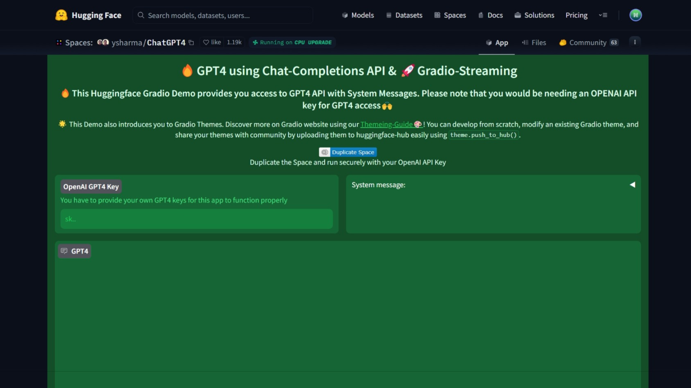

OpenAI, an American artificial intelligence (AI) research company released an AI chatbot named ChatGPT on November 2022. After releasing ChatGPT, it crossed over a million user within 5 days. And reached 100 million users within 2 months. On March 14, 2023 OpenAI released GPT-4 (latest) which is a families of large language models (LLMs) comes with improved features and capabilities, including multimodal capabilities for interpreting both text and image inputs, exceptional performance in reasoning tests, and support for over 26 different languages.

However, it is not accessible to free users. It is available only via API and ChatGPT premium users for 20$. But today I'll guide you how you can use GPT-4 AI language model for free. Let's jump into the guide.

## 1. [ForeFront](https://www.forefront.ai/)

Forefront Chat is a new tool launched by Forefront AI that offers free access to GPT-4, but recently you can only send 5 messages every 3 hours. It provides more people with the opportunity to try out this cutting-edge technology. To access GPT-4, all you need to do is sign up for free on the Forefront Chat website. Apart from GPT-4, users can also try image generation, custom personas, shareable chats, and more on the platform.

## 2. [Ora](https://ora.ai/)

Ora is a web platform that allows you to build LLM apps in a shareable chat interface. The developer is now providing users with the opportunity to explore [ChatGPT 4](https://ora.ai/openai/gpt4) for free, but has limited the usage to 1 message per day due to high demand.

## 3. [Microsoft Copilot](https://copilot.microsoft.com/)

Microsoft Copilot is another option to access GPT-4 for free. You can send unlimited messages for free. Bing AI has announced that it is already running on the GPT-4 model, also known as "Prometheus," and has some additional features, such as the ability to generate images with a simple prompt and provide cited sources of information.

## 4. [HuggingFace](https://huggingface.co/spaces/ysharma/ChatGPT4)

If you're looking for another way to experiment with ChatGPT 4, check out the free bot built by developer Yuvraj Sharma on HuggingFace. You don't even need your own OpenAI API key to use it, as GPT-4 API access is provided by HuggingFace to its community. It also has multilingual support and a token limit of 4096.

## 5. [Nat.dev](https://nat.dev/)

Former CEO of GitHub, Nat Friedman has created an amazing tool to compare different language models offered by AI companies all around the world. It is a tool that can show you how ChatGPT 4 stacked up against other models or just let you explore the incredible GPT-4 model on your own.

## 6. [Perplexity](https://www.perplexity.ai/)

Perplexity AI is a web crawler that uses machine learning to generate general answers to your queries and then offer a series of website links. The links are to websites that the AI thinks are relevant to your query. It is a new AI chat tool that acts as an extremely powerful search engine. When a user inputs a question, the model scours the internet to give an answer. And what’s great about this tool, is its ability to display the source of the information it provides². It unlocks the power of knowledge with information discovery and sharing. It was built using the same model as Chat GPT (GPT-3), however, offers a very different service.

## 7. [Poe](https://poe.com/)

Poe is a chatbot assistant that lets you ask questions, get instant answers, and have back-and-forth conversations with AI. It gives access to several bots powered by OpenAI and Anthropic. Poe Fast AI Chatbot Assistant is designed for users 12+ and provides a fast, helpful AI chat experience. Quora launched a platform called Poe that lets people ask questions, get instant answers and have a back-and-forth conversation with AI. Poe offers access to ChatGPT and GPT-4; Claude Plus and Claude Instant, two different bots from Anthropic; Sage, also based on ChatGPT; and Dragonfly, a model using a different method than the others.

As technology continues to evolve, it's exciting to imagine what other groundbreaking advancements in AI are on the horizon. So, what are you waiting for? Dive into the world of ChatGPT-4 and discover its wonder for yourself!
